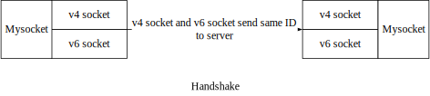
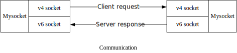

# ParallelSocket
A special C/S model using dual stack.

----

# 介绍



服务器同时监听 v4 和 v6 相同或不同的端口，等待客户端请求。

客户端分别用 v4 和 v6 连接到服务器，并通过发送相同会话ID的方式，让服务器确认两个连接是来自同一个客户端。



通信时，客户端使用 v4 向服务器发送请求，服务器不通过 v4 返回，而是通过 v6 返回数据。

----

# 测试

1. 准备两台双栈机器

2. 在其中一台（称为 A ）上面，编译本仓库的代码，并执行可执行文件（监听30000端口）

3. 在另一台（称为 B ）上面，开启两个终端

   终端 1 上使用 netcat 通过 IPv4 连接 A 的进程

   ```sh
   $ nc <A v4 IP> 30000           // 连接
   114514                         // 发送一个数字 ID 给服务端
   ```

   终端 2 上使用 netcat 通过 IPv6 连接 A 的进程

   ```sh
   $ nc <A v6 IP> 30000			// 连接
   114514							// 发送相同的数字 ID 给服务器
   ```

4. 握手完成后，在 B 的终端 1 上发送任意字符串，服务器处理完会通过 v6 返回，B 可以在终端 2 上收到结果

5. 如此，通信双方的请求和响应不在同一个连接上，如果这样的连接方式普遍应用，是不是能够有一定的抗审查能力或者增加审查者的负担？
